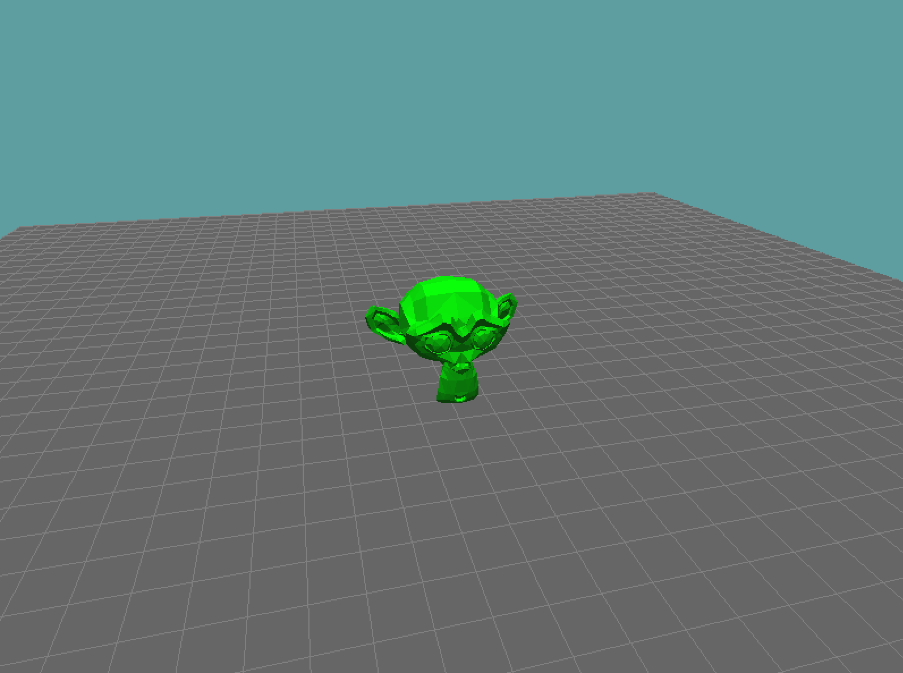

# Test it

With your new OBJ class loading and presumably rendering primitives it's time to take it for a spin. I'm going to provide a test scene, download [this](test_object.obj) file and put it in assets to test with.

```cs
using System;
using OpenTK.Graphics.OpenGL;
using Math_Implementation;

namespace GameApplication {
    class OBJLoadingExample : Game {
        Grid grid = null;
        OBJModel model = null;
        protected Vector3 cameraAngle = new Vector3(0.0f, -25.0f, 10.0f);
        protected float rads = (float)(Math.PI / 180.0f);

        public override void Resize(int width, int height) {
            GL.Viewport(0, 0, width, height);
            GL.MatrixMode(MatrixMode.Projection);
            float aspect = (float)width / (float)height;
            Matrix4 perspective = Matrix4.Perspective(60.0f, aspect, 0.01f, 1000.0f);
            GL.LoadMatrix(Matrix4.Transpose(perspective).Matrix);
            GL.MatrixMode(MatrixMode.Modelview);
            GL.LoadIdentity();
        }

        public override void Initialize() {
            GL.Enable(EnableCap.DepthTest);
            GL.Enable(EnableCap.CullFace);
            GL.Enable(EnableCap.Lighting);
            GL.Enable(EnableCap.Light0);

            Resize(MainGameWindow.Window.Width, MainGameWindow.Window.Height);

            grid = new Grid(true);
            model = new OBJModel("Assets/test_object.obj");

            GL.Light(LightName.Light0, LightParameter.Position, new float[] { 0.0f, 0.5f, 0.5f, 0.0f });
            GL.Light(LightName.Light0, LightParameter.Ambient, new float[] { 0f, 1f, 0f, 1f });
            GL.Light(LightName.Light0, LightParameter.Diffuse, new float[] { 0f, 1f, 0f, 1f });
            GL.Light(LightName.Light0, LightParameter.Specular, new float[] { 1f, 1f, 1f, 1f });
        }

        public override void Shutdown() {
            model.Destroy();
        }

        public override void Update(float dTime) {
            cameraAngle.X += 30.0f * dTime;
        }

        public override void Render() {
            Vector3 eyePos = new Vector3();
            eyePos.X = cameraAngle.Z * -(float)Math.Sin(cameraAngle.X * rads) * (float)Math.Cos(cameraAngle.Y * rads);
            eyePos.Y = cameraAngle.Z * -(float)Math.Sin(cameraAngle.Y * rads);
            eyePos.Z = -cameraAngle.Z * (float)Math.Cos(cameraAngle.X * rads) * (float)Math.Cos(cameraAngle.Y * rads);

            Matrix4 lookAt = Matrix4.LookAt(eyePos, new Vector3(0.0f, 0.0f, 0.0f), new Vector3(0.0f, 1.0f, 0.0f));
            GL.LoadMatrix(Matrix4.Transpose(lookAt).Matrix);

            GL.Disable(EnableCap.Lighting);
            GL.Disable(EnableCap.DepthTest);
            grid.Render();
            GL.Enable(EnableCap.DepthTest);
            GL.Enable(EnableCap.Lighting);

            GL.Color3(1f, 1f, 1f);
            model.Render(true, false);
        }
    }
}
```

If your OBJ loads and renders properly, the above scene should look like this, with a rotating camera:

