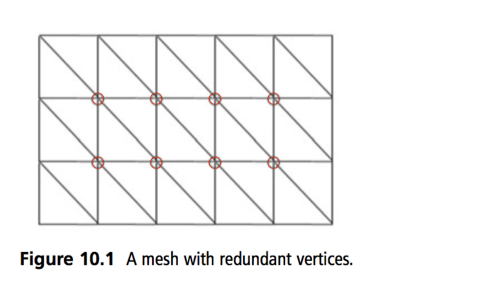

# Vertex Arrays

Thus far, all examples have used the```GL.Begin``` / ```GL.End``` method of drawing objects. This method is  refered to as __Immediate Mode Rendering__.  Immediate mode is useful for simple applications and prototype code as it is easy to understand and visualize. However it comes with some performance penalties that make it less useful for applications that need to render lots of geometry at a high framerate, like games.

For example, let's say you're rendering a model containing 2,000 lit and textured triangles using immediate mode. Assume that you're able to pack all of the vertex data into a single triangle strip (This is the best case scenario, it's often not possible). Your rendering code _might_ look like this:

```cs
GL.Begin(PrimitiveType.TriangleStrip);

for (int i = 0; i < 2002; ++i) { // 2002 because of the triangle STRIP
  GL.Normal3(normals[i][0], normals[i][1], normals[i][2]);
  GL.TexCoord2(uvs[i][0], uvs[i][1]);
  GL.Vertex3(verts[i][0], verts[i][1], verts[i][2]);
}

GL.End();
```

There are several problems here, the first of which is that in order to render this model we make over 6000 function calls! Remember, no function call is free! Every function call has a very tiny overhead, but with over 6000 calls, this overhead adds up really fast!

The second and third problems are illustrated in this image:



Assuming that this mesh is made up of triangle strips (perhaps it's a portion of the mesh created in pseudo-code above), each circled vertex is redundant. In other words, these vertices are shared by more than 3 triangles, but since a triangle strip can represent at most three triangles per vertex, each of the circled vertices have to be sent to the graphics card more than once.

This results in additional bandwith when uploading data to the video card. More importantly, those vertices will need to be transformed and lit multiple times, once for each duplicate vertex.

To address these issues OpenGL provides vertex arrays. A Vertex array has the following advantages:

* Large batches of data can be sent with a small number of function calls. 
  * Using vertex arrays we could reduce the above example from 6000 function calls to 2
* Through the use of indexed vertex arrays, vertices can be sent exactly once per triangle mesh, reducing bandwith and lighting calculations
  * This is the reason 90% of the things we render are triangles, not quads or triangle strips
  * When rendered with indexed arrays we can avoid sending duplicate data

Moving forward, whenever possible i want you to avoid immediate mode rendering and only use vertex arrays. It's the only viable way to render and maintain high framerates. No professional game ships with immediate mode, it's only used to prototype.

Now that we've discussed the reasons for using vertex arrays, let's see how they are used. 

## Array based data