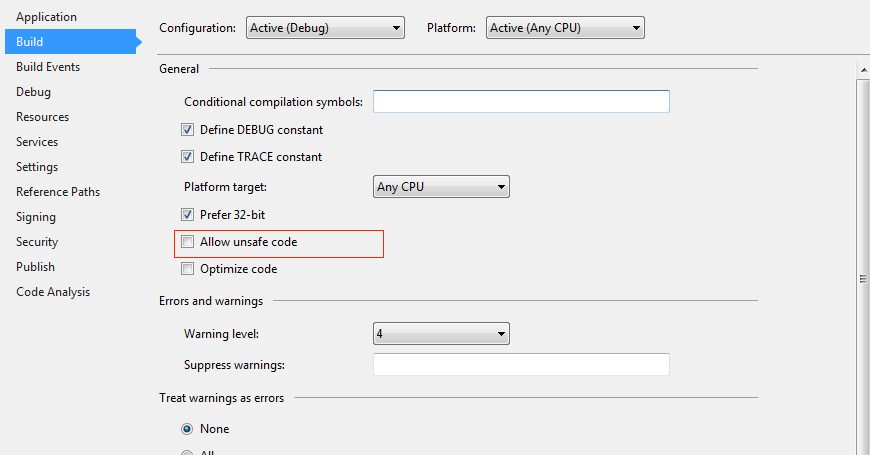

#Pinning

The following section is copied from [This](http://www.opentk.com/doc/graphics/geometry/vertex-arrays) article, which explains how vertex arrays should be used. [This](http://www.opentk.com/doc/chapter/2/opengl/geometry/drawing) page also provides some very usable information on rendering in OpenTK.

You don't have to store data in linear arrays. So long as your data is laid out linearly, you can use pointers to access it as if it where arrays. If you want to use strides within your arrays, that is have all vertex data in a large array instaed of having a color and a position array, you have to use pointers

# Advanced

You will NOT need to do this if you just store your vertex data in linear array. This is actually super advanced, but i figured i'd dedicate a page to it for the sake of completeness.

Vertex Arrays use client storage, because they are stored in system memory (not video memory). Since .Net is a Garbage Collected environment, the arrays must remain pinned until the GL.DrawArrays() or GL.DrawElements() call is complete.

Pinning an array means that while the array is pinned the garbage collector is not allowed to touch it. If the arrays are unpinned prematurely, they may be moved or collected by the Garbage Collector before the draw call finishes. This will lead to random access violation exceptions and corrupted rendering, issues which can be difficult to trace.

Due to the asynchronous nature of OpenGL, ```GL.Finish()``` must be used to ensure that rendering is complete before the arrays are unpinned. Let's take a look at how this might be used in context:

```cs
struct Vertex {
    public Vector3 Position;
    public Vector2 TexCoord;
}
// Vertex size = 5 * sizeof(float)
 
Vertex[] vertices = new Vertex[100];
 
unsafe { // MUST BE CALLED TO ACCESS POINTERS
    fixed (float* pvertices = vertices) { // Pins memory
        GL.VertexPointer(3, VertexPointerType.Float, 5 * sizeof(float), pvertices);
        GL.TexCoordPointer(2, VertexPointerType.Float, 5 * sizeof(float), pvertices + sizeof(Vector3));
        GL.DrawArrays(BeginMode.Triangles, 0, vertices.Length); // Discussed in next section
        GL.Finish();    // Force OpenGL to finish rendering while the arrays are still pinned.
    }
}
```

Notice that all of the code is wrapped in an __unsafe__ section. In order to use pointers you must tell C# that the code you are using is going to be touching memory directly, since this is considered risky business in the C# world we put all such code in an unsafe block.

The __fixed__ keyword will pin memory to the desired variable until the fixed block is exited. A pointer datatype is denoted by adding an asterix (\*) after the variable type. So a pointer to an array bacomes ```float*```, but a pointer to a single floating point value would also be ```float*```. 

In order to run unsafe code, you need to turn it on as a compiler option. You can just check the option under project settings:


