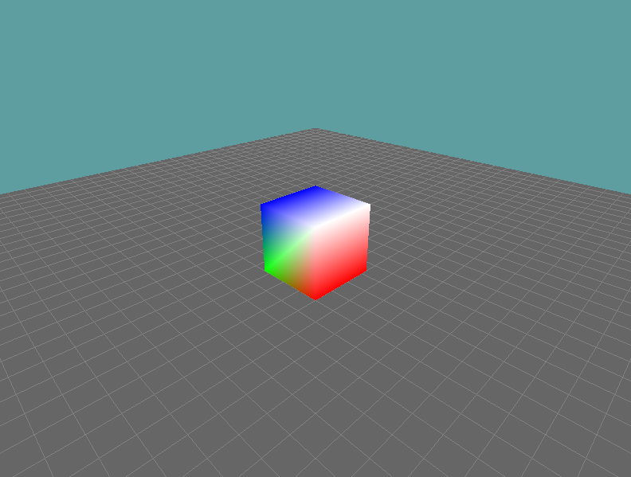

# Example

You should go ahead and code along with this example.

First, we include the required libraries, and define our standard application:

```
using OpenTK.Graphics.OpenGL;
using Math_Implementation;

namespace GameApplication {
    class DrawElementsExample : Game {
```

Next up are member variables. This demo will have the standard grid, and a cube that has different colors for each vertex. So we're going to make 3 arrays. One for the vertex positions, one for the vertex colors, and one for the indices into the previous two arrays to draw.

```
        Grid grid = null;
        float[] cubeVertices = null;
        float[] cubeColors = null;
        uint[] cubeIndices = null;
```

Next up is a standard copy / paste resize function:

```
        public override void Resize(int width, int height) {
            GL.Viewport(0, 0, width, height);
            GL.MatrixMode(MatrixMode.Projection);
            float aspect = (float)width / (float)height;
            Matrix4 perspective = Matrix4.Perspective(60.0f, aspect, 0.01f, 1000.0f);
            GL.LoadMatrix(Matrix4.Transpose(perspective).Matrix);
            GL.MatrixMode(MatrixMode.Modelview);
        }
```

In the ```Initialize``` function we're going to make a solid grid. We're also going to populate the box arrays. Take note, we only define vertices for the front (1 - 4) and back (5 - 8) faces of the cube. Same with colors. This is because those corners are shared with the top, bottom, left and right faces. We can just include them using the index array.

```
        public override void Initialize() {
            grid = new Grid(true);

            cubeVertices = new float[] {
                -1.0f, -1.0f,  1.0f, // Vertex 1
                 1.0f, -1.0f,  1.0f, // Vertex 2
                 1.0f,  1.0f,  1.0f, // Vertex 3
                -1.0f,  1.0f,  1.0f, // Vertex 4
                -1.0f, -1.0f, -1.0f, // Vertex 5
                 1.0f, -1.0f, -1.0f, // Vertex 6
                 1.0f,  1.0f, -1.0f, // Vertex 7
                -1.0f,  1.0f, -1.0f  // Vertex 8
            };

            cubeColors = new float[] {
                1.0f, 0.0f, 0.0f, // Vertex 1
                0.0f, 1.0f, 0.0f, // Vertex 2
                0.0f, 0.0f, 1.0f, // Vertex 3
                1.0f, 1.0f, 1.0f, // Vertex 4
                1.0f, 0.0f, 0.0f, // Vertex 5
                0.0f, 1.0f, 0.0f, // Vertex 6
                0.0f, 0.0f, 1.0f, // Vertex 7
                1.0f, 1.0f, 1.0f  // Vertex 8
            };
```

Still in ```Initialize``` we next need to define the index array. Of course we need two triangles / cube face. The way to read this is each integer here is an index into the ```cubeVertices``` and ```cubeColors``` array.

```
            cubeIndices = new uint[] {
                // Front
		        0, 1, 2, // Front triangle 1
                2, 3, 0, // Front triangle 2
		        // Top
		        1, 5, 6, // Top triangle 1
                6, 2, 1, // Top triangle 2
		        // Back
		        7, 6, 5, // Back traignle 1
                5, 4, 7, // Back triangle 2
		        // Bottom
		        4, 0, 3, // Bottom triangle 1
                3, 7, 4, // Bottom triangle 2
		        // Left
		        4, 5, 1, // Left triangle 1
                1, 0, 4, // Left triangle 2
		        // Right
		        3, 2, 6, // Right triangle 1
                6, 7, 3  // Right triangle 2
            };
        }
```

Finally let's get started on the ```Render``` function. First we load up a modelview matrix, then render the grid:

```
        public override void Render() {
            Matrix4 lookAt = Matrix4.LookAt(new Vector3(-7.0f, 5.0f, -7.0f), new Vector3(0.0f, 0.0f, 0.0f), new Vector3(0.0f, 1.0f, 0.0f));
            GL.LoadMatrix(Matrix4.Transpose(lookAt).Matrix);

            GL.Disable(EnableCap.DepthTest);
            grid.Render();
            GL.Enable(EnableCap.DepthTest);

```

In order to use ```DrawElements``` (Or ```DrawArrays```) we must first enable client states for each vertex attribute we're going to be rendering:

```
            GL.EnableClientState(ArrayCap.VertexArray);
            GL.EnableClientState(ArrayCap.ColorArray);
```

Next, we need to tell OpenGL where to find that vertex data:

```
            GL.VertexPointer(3, VertexPointerType.Float, 0, cubeVertices);
            GL.ColorPointer(3, ColorPointerType.Float, 0, cubeColors);
```

And finally, we just call DrawElements with the right arguments. Remember, the count argument is how many vertices you are rendering, NOT TRIANGLES.

```
            GL.DrawElements(PrimitiveType.Triangles, cubeIndices.Length, DrawElementsType.UnsignedInt, cubeIndices);
```

After the cube has ben drawn we should Disable any client states that we enabled. This is just so the next draw call can work.

```
          GL.DisableClientState(ArrayCap.VertexArray);
          GL.DisableClientState(ArrayCap.ColorArray);
        }
    }
}
```

Compare what we just wrote to the [Cube function in Primitives.cs](https://github.com/Mszauer/OpenGL1X/blob/master/GameApplication/Primitives.cs#L100) (line 100). You can see how much cheaper this is, it doesn't use duplicate vertices, and is using FAR less draw calls!

The final application should look like this:

