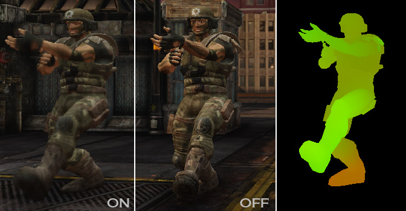
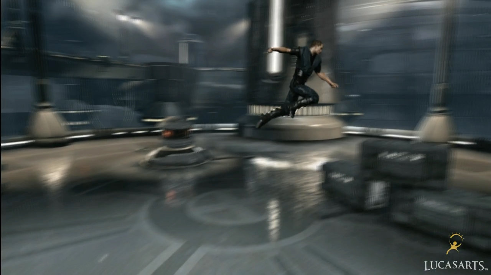
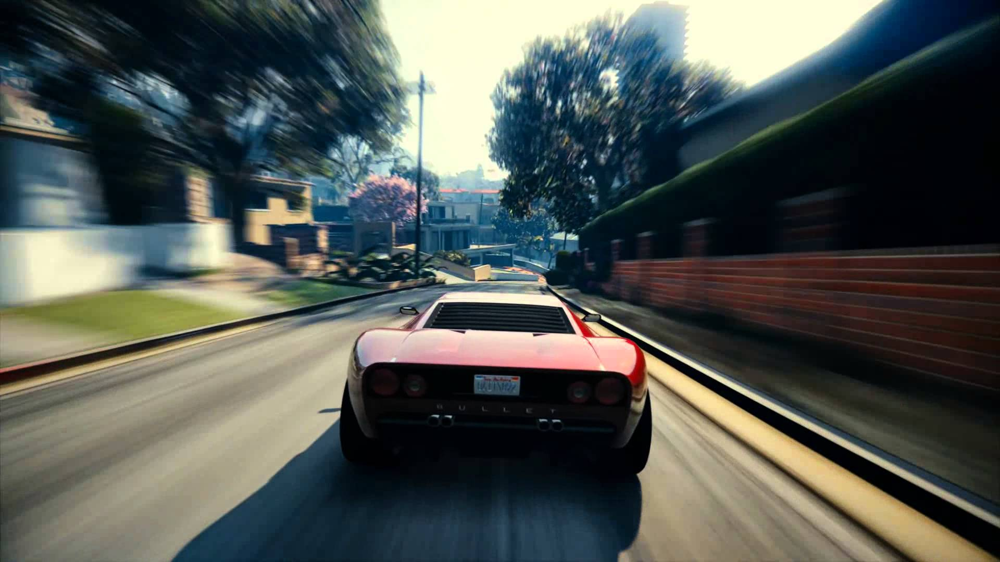

# Motion Blur

I personally find motion blur super anoying in games, but it seems like every new game that comes out uses it. So i guess this warrants a brief discussion. What does motion blur in games look like:

Applied to the character:

Applied to everything but the cahracter

Applied to everything:

I think the only place motion blur _really_ makes sense is in racing games:

### The effect

So how is motion blur achieved? OpenGL has something called an accumulation buffer. You can store the color buffer from the last N frames (N can be any number depending on your GPU support, the OpenGL specs guarantee it will at least be 3) and blend them together. 

Blending the last 3 to 8 frames causes them to look blured. You can render everything blured, or use the stencyl buffer to render some things not blured at all. OR you could render things from your scene (Not blured) at 80% oppacity to make them look kind of blurred, but less so than the rest of the scene.