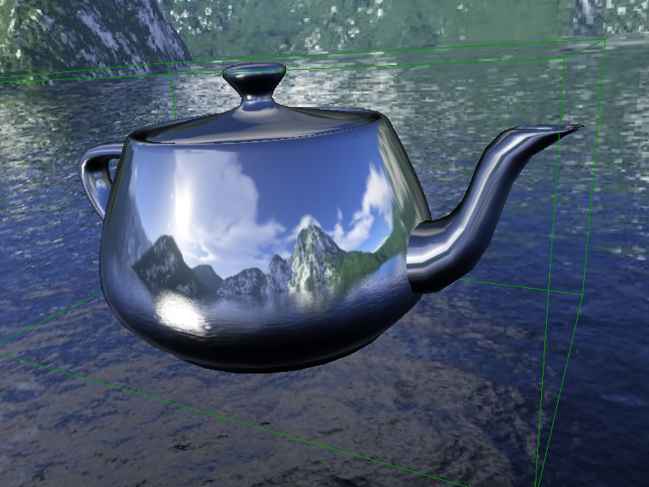
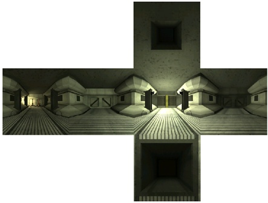
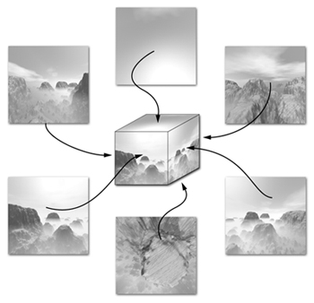

#Cubemap reflection

Cube map reflections solve the major issue of planar reflections, somplex shapes. Any racing game you play where the cars have some sort of real reflection on the paint, or any time you see a complex shape reflect something, it's a cubemap. 

A cubemapped reflection will look like this:

So, how to we achieve this effect? First the scene has to be rendered 6 times from the point of view of the object, into a cube map. If you remember, when we bind textures, one of the texture targets to bind to is __CubeMap__. This is what a rendered map will look like:

Now comes the magic, when you render the object, OpenGL will take pixel color from the cube map. Imagine a cube that's just big enough to surroung the object being rendered (The green outline around the tea pot). The cube map is wrapped around this cube:

