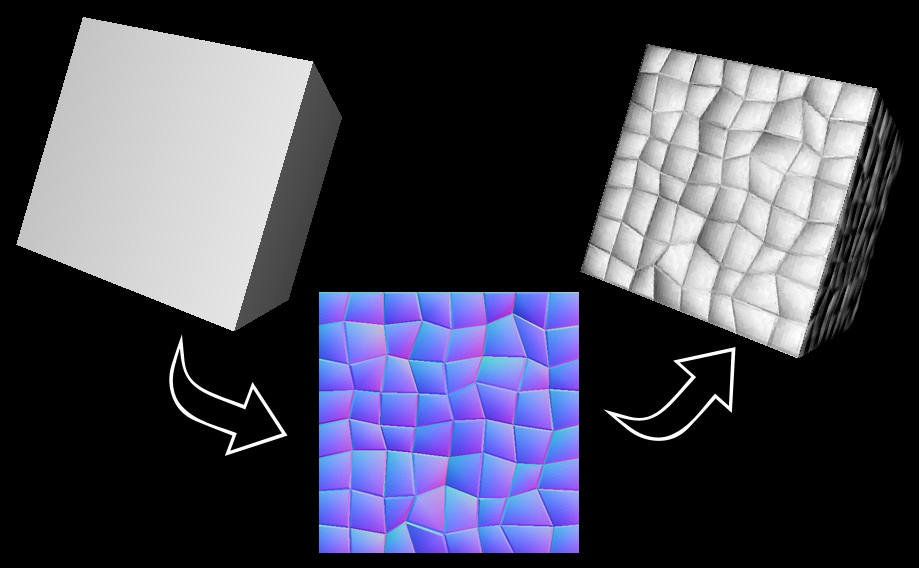
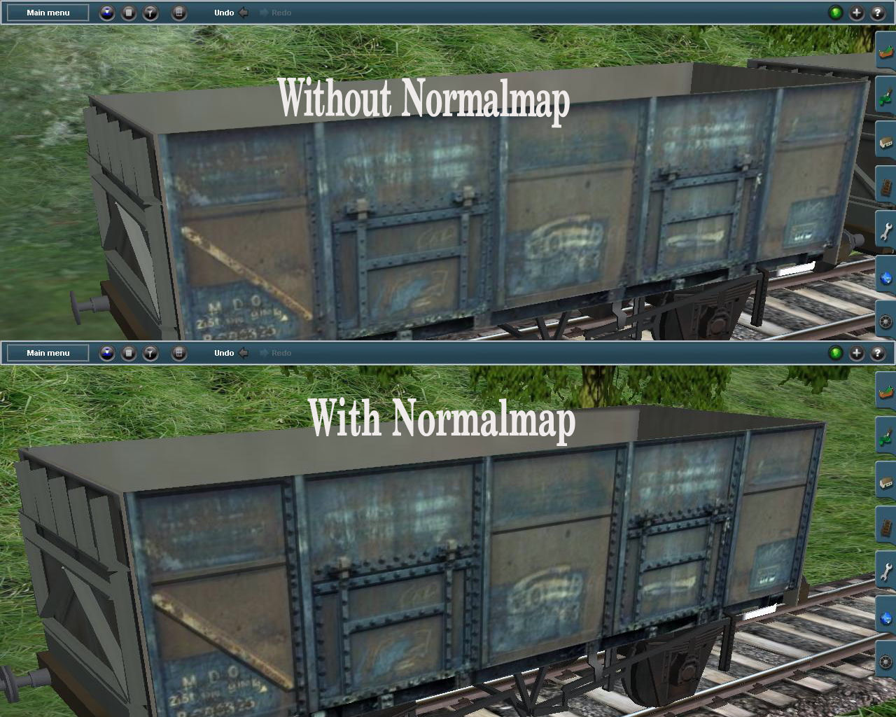

#Normal Mapping

Normal Mapping is a great way to add realism to any 3D model. Recall from when we learned about the lighting calculations in OpenGL that lighting is calculated on a per vertex level. This means the closer your vertices, the better the lights look.

Normal mapping essentially encodes normal data into a texture (The R component of a pixel is the X component of the encoded normal, the G is the Y and the B is the Z). OpenGL then uses this texture with uv coordinates like normal textures, but instead of drawing the texture as a color, it uses it as a normal.

This gives us PER PIXEL normal mapping!

This is a method we will implement when we learn about "Modern OpenGL"

