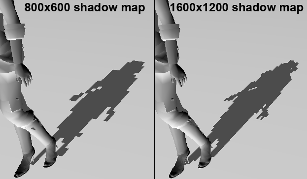

# Shadow Mapping

Shadow mapping is the "modern" way to render shadows. The quality of shadow mapped shadows is MUCH lower than that of Stencyl Shadows, but performance wise shadow maps are MUCH faster. We will probably implement this method of shadowing later.

The concept of a shadow map is simple, render the entire scene into an off-screen color buffer from the point of view of the light. Then render the scene normally from the point of view of the camera. If the Z value of the camera pixel being rendered is closer than the Z value of the shadow pixel, the object is in shadow.

Shadow mapping suffers from resolution issues. Because the off screen buffer is just pixels, it can alias. A low resolution shadow map looks like crap!

You can find a really good tutorial on how to do shadow mapping with OpenGL 1 (Legacy OpenGL, what we've been using) [here](http://www.paulsprojects.net/tutorials/smt/smt.html), but it becomes MUCH easyer to implement with OpenGL 2.

Here is an image comparing different resolution shadow maps. The quality can be aweful!

